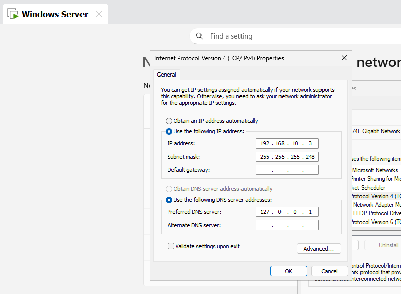

# Part 1 — Networking

## Objective

Build the foundational network for the MookTech virtual environment and establish communication between the Windows Server and Windows 11 clients.

## Network Configuration

Configured static IPv4 addresses for the lab's virtual machines.

| Device | IP Address | Subnet Mask | Role |
|---|---|---|---|
| Windows Server | `192.168.10.3` | `255.255.255.248` | Domain Controller / DNS |
| Windows 11 Client 1 | `192.168.10.1` | `255.255.255.248` | Domain Client |
| Windows 11 Client 2 | `192.168.10.2` | `255.255.255.248` | Domain Client |

## Connectivity Testing

Tested communication between the virtual machines using ICMP ping.

Client 1 successfully communicated with the Windows Server, while Client 2 successfully communicated with Client 1.

## Firewall Configuration

Configured Windows Firewall to allow ICMP Echo Requests so the virtual machines could communicate with each other.

## Troubleshooting

Initial connectivity issues were caused by Windows Firewall blocking ICMP traffic. Inbound ICMP Echo rules were enabled to allow successful ping testing.

## Screenshots

### Server IP Configuration

### Client 1 IP Configuration

### Client 2 IP Configuration

### Client-to-Server Ping

### Client-to-Client Ping

### Firewall ICMP Rule

## What I Learned

- IPv4 addressing
- `/29` subnetting
- VMware virtual networking
- ICMP connectivity testing
- Windows Firewall configuration
- Basic network troubleshooting
