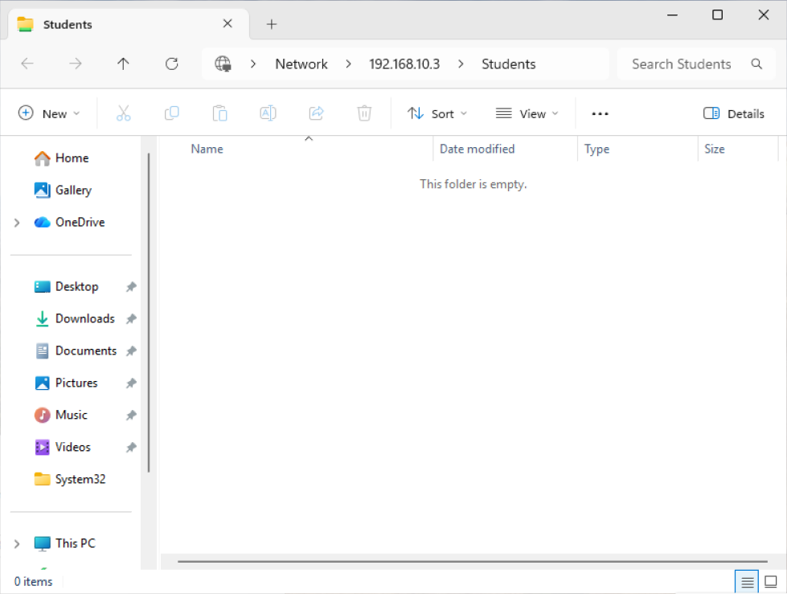
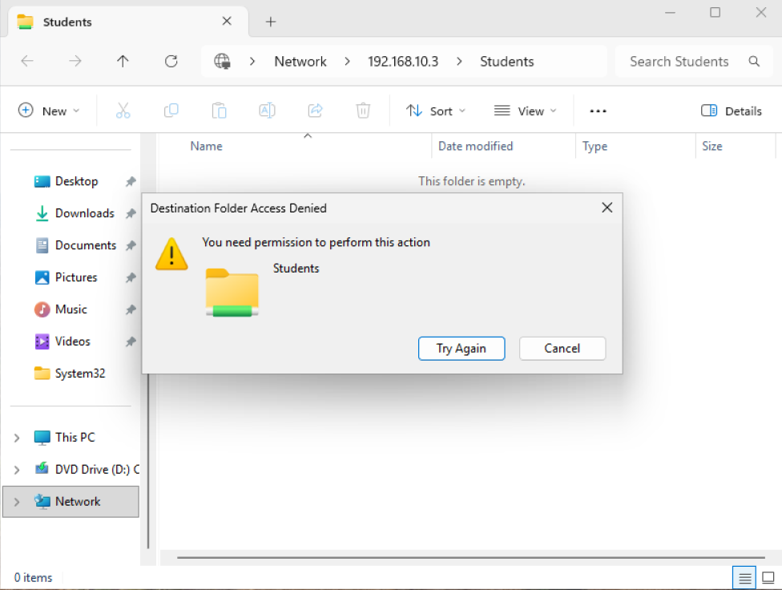

# Part 3 — Users, Groups & File Permissions

## Objective

Organize the MookTech domain by department and implement role-based access to shared network resources.

## Organizational Units

Created Organizational Units in Active Directory to organize users and resources by department.

The following OUs were created:

- `HR-Staff`
- `IT-Staff`
- `Students`

### Organizational Units


## Security Groups

Created security groups to manage access based on organizational roles.

- `IT-Users`
- `HR-Users`
- `Student-Users`

Groups were configured as Global Security groups within Active Directory.

### Security Groups


## User Management

Created domain users and assigned them to appropriate security groups.

User accounts were managed through Active Directory Users and Computers.

## Shared Folders

Created departmental shared folders on the Windows Server.

```text
C:\Shares\
├── HR
├── IT
└── Students
```

The folders were configured as Windows network shares for access from domain-joined clients.

### Shared Folders


## Permissions

Configured NTFS permissions to control access to shared resources.

Permissions were assigned using Active Directory security groups rather than individual users where appropriate.

### NTFS Permissions


## Access Testing

Tested access to the `Students` network share from a domain-joined Windows 11 client.

Example network path:

```text
\\192.168.10.3\Students
```

The Students share was successfully accessed from the client.

### Successful Share Access



## Troubleshooting

Encountered a permission issue while testing write access to the network share.

The client was able to access the `Students` share, but attempting to create a file resulted in a Windows permission error.

### Share Permission Troubleshooting



Troubleshooting included:

- Verifying domain credentials
- Checking share permissions
- Checking NTFS permissions
- Verifying the network share existed
- Testing connectivity to the Windows Server

## What I Learned

- Active Directory Organizational Units
- Security groups
- Domain user management
- NTFS permissions
- SMB network shares
- Share permissions
- Role-based access control
- Windows authentication
- File-sharing troubleshooting
