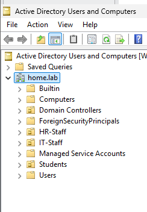
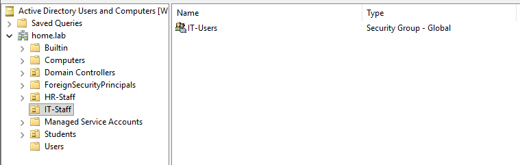
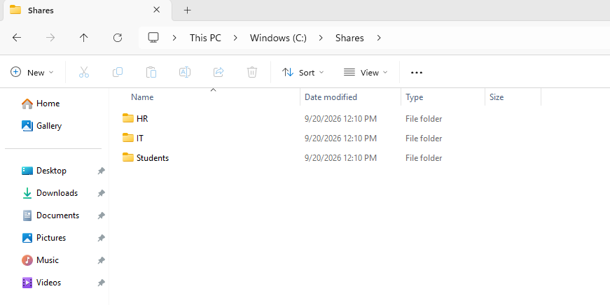
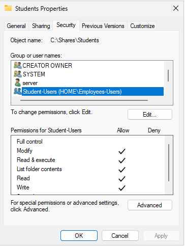

# Part 3 — Users, Groups & File Permissions

## Objective

Organize the MookTech domain by department and implement role-based access to shared network resources.

## Organizational Units

Created Organizational Units in Active Directory to organize users and resources by department.

The following OUs were created:

- `HR-Staff`
- `IT-Staff`
- `Students`

### Organizational Units



## Security Groups

Created security groups to manage access based on organizational roles.

- `IT-Users`
- `HR-Users`
- `Student-Users`

Groups were configured as Global Security groups within Active Directory.

### Security Groups



## User Management

Created domain users and assigned them to appropriate security groups.

User accounts were managed through Active Directory Users and Computers.

### Shared Folders



## Permissions

Configured NTFS permissions to control access to shared resources.

Permissions were assigned using Active Directory security groups rather than individual users where appropriate.

### NTFS Permissions



## Access Testing

Tested access to the `Students` network share from a domain-joined Windows 11 client.

Example network path:

```text
\\192.168.10.3\Students
